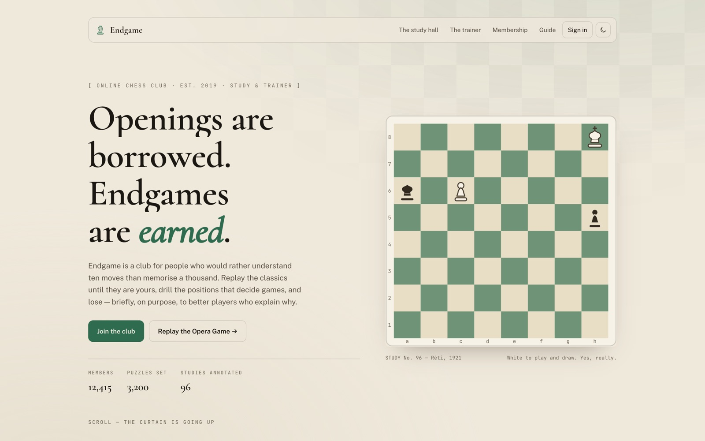

<!-- parable:beautified -->
<div align="center">

<h1>Endgame</h1>

<p><strong>Online chess club — a board replays a classic miniature as you scroll, notation ticker keeping pace.</strong></p>

<p>
  <a href="https://bswxyz.github.io/endgame/"></a>
  
  
  <a href="LICENSE"></a>
</p>

<p>
  <a href="https://bswxyz.github.io/endgame/"><b>Live demo</b></a>
  &nbsp;·&nbsp;
  <a href="https://bswxyz.github.io/endgame/guide/">Build notes</a>
  &nbsp;·&nbsp;
  <a href="https://parable-three.vercel.app/templates">More templates</a>
</p>

<a href="https://bswxyz.github.io/endgame/">
  
</a>

</div>

**Use this template** — copy the source into a new project:

```bash
npx degit bswxyz/endgame my-app
```


A design-showcase website template from the **Parable** collection. Endgame is a fictional online
chess club for people who would rather understand ten moves than memorise a thousand. Its
signature: the **Opera Game (Morphy, 1858) replayed move-by-move as you scroll**, with the
notation ticking in lockstep, captions surfacing on the key moves, and play / step controls that
drive the same scroll timeline.

## Concept

- **Voice** — studious, dry-witted, reverent about the classics. Speaks in openings and endgames.
- **Hero** — Réti's 1921 king-walk study on a real SVG board, pieces taking their seats one by one.
- **The study hall** — the scroll-scrubbed Opera Game: 34 precomputed position snapshots,
  CSS-transitioned SVG pieces, a score ticker, and captions on the sacrifices.
- **The trainer / membership / members' book / club door** — the full club, not a one-gimmick page.

## Design system

| Token | Light (default) | Dark |
| --- | --- | --- |
| `--bg` | bone `#efe9dc` | walnut `#1b1712` |
| `--ink` | walnut `#1b1712` | bone `#efe9dc` |
| `--accent` | felt green `#2e6b4f` | felt green (lifted) `#55a37d` |
| secondary | brass `#b08d3c` (as `--brass` / `--brass-ink`) | same, lifted |

- **Type** — Cormorant (display) · Public Sans (body) · JetBrains Mono (notation, ratings, labels).
- **Signature ease** — "felt landing": `cubic-bezier(.32,.94,.18,1)` — quick off the hand, soft on
  the square.
- Both themes live in `:root[data-theme]` at the top of `src/app.css`; the nav toggle persists to
  `localStorage` under `endgame-theme`.

## Stack

SvelteKit + `@sveltejs/adapter-static`, fully prerendered — no server code, no images (all art is
inline SVG). Output goes to `docs/` with a production base path of `/endgame` for GitHub Pages.

## Run locally

```sh
npm install
npm run dev        # dev server, base path ''
npm run build      # prerenders into docs/ with base '/endgame'
npm run preview
```

## Structure

```
src/
├── app.html                 .js gate + theme bootstrap + fonts
├── app.css                  design tokens (both themes) + all styles
├── routes/
│   ├── +layout.js           prerender = true, trailingSlash = 'always'
│   ├── +layout.svelte
│   ├── +page.svelte         the club — hero, study, trainer, tiers, book, sign-in
│   └── guide/+page.svelte   "How Endgame was built"
└── lib/
    ├── game.js              the Opera Game as data + snapshot builder
    ├── Board.svelte         SVG board; pieces = keyed groups with CSS transforms
    ├── OperaStudy.svelte    the scroll-driven replay (signature flourish)
    ├── PieceDefs.svelte     hand-drawn piece symbols, themed via CSS vars
    └── motion.js            reveal + counter actions, reduced-motion helper
```

## Accessibility & motion

- Content is never hidden without JavaScript — reveal states are gated behind a `.js` class set
  synchronously in `<head>`; the no-JS study section shows the final position with the full score.
- Full `prefers-reduced-motion` support: reveals resolve instantly, pieces stop gliding, and the
  replay renders as a single static frame (final position + complete notation). No loops run.
- Skip link, `:focus-visible` outlines, labelled controls, `aria-hidden` decorative layers.

## Demo vs real

Everything interactive is front-end only. The **sign-in form is a demo**: it validates and
confirms in place and **sends nothing anywhere** — no network request, no storage. Members,
ratings, prices and league nights are fiction (the Opera Game is not). To make the club real,
wire the form to your auth provider and the tiers to your billing.

## License

MIT — see [LICENSE](./LICENSE). Designed & built by Parable.
